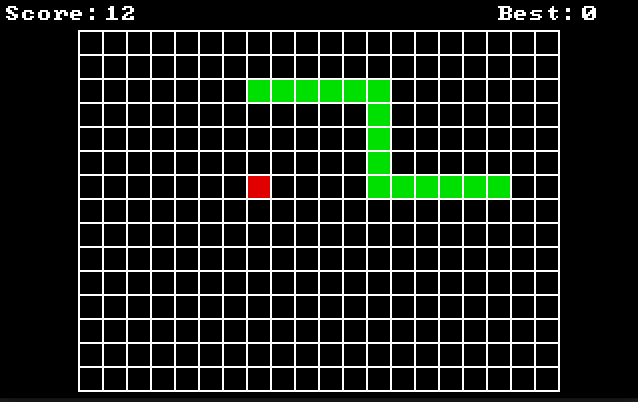

# Snake-OS

This techically is a ring 0 tiny kernel but Snake-OS sounds better

#### Features:
- 32-bit (x86)
- Fully custom bootloader
- Simple keyboard driver
- Simple graphics driver

#### Resources Used
- [osdev.org wiki](https://wiki.osdev.org/Main_Page)
- [James Molloy's Kernel Development Tutorials](http://www.jamesmolloy.co.uk/tutorial_html/)
- [osdever tutorials](http://www.osdever.net/tutorials/view/interrupts-exceptions-and-idts-part-1-interrupts-isrs-irqs-the-pic)
- [Queso Fuego Youtube Channel](https://www.youtube.com/@QuesoFuego)
- [Daedalus Community Youtube Channel](https://www.youtube.com/@DaedalusCommunity)

### Building & Running
**NOTE**: This has only been tested with the QEMU emulator.

To get all essential software run the SETUP.sh, if the script is not compatible with your Linux distro I'd suggest following the link in the file to check the other version of SETUP.sh.

Running with WSL on Windows also works.

### Other
This project was innitally inspired by [jdh's tetris OS](https://youtu.be/FaILnmUYS_U) video from which I decided to try my making my own version around the same concept.